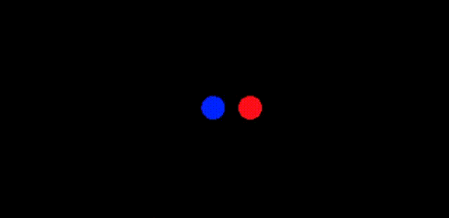

# Causal Simulations in WebPPL

Using physics simulations inside probabilistic programs.

This is part of a project trying to model the semantics and pragmatics of causal language in a rational speech acts framework using counterfactual simulation.

Some relevant papers:

* Gerstenberg, T., Peterson, M. F., Goodman, N. D., Lagnado, D. A., & Tenenbaum, J. B. (2017). Eye-Tracking Causality. Psychological Science, 28(12), 1731–1744. https://doi.org/10.1177/0956797617713053
* Lucas, C. G., & Kemp, C. (2015). An improved probabilistic account of counterfactual reasoning. Psychological Review, 122(4), 700–734. https://doi.org/10.1037/a0039655
* Frank, M. C., & Goodman, N. D. (2014). Inferring word meanings by assuming that speakers are informative. Cognitive Psychology, 75, 80–96. https://doi.org/10.1016/j.cogpsych.2014.08.002

## Installation

Dependencies:

* [webppl](http://webppl.org/)
* [nodejs](https://nodejs.org/en/) (and [npm](https://www.npmjs.com/))

Install node packages:

```
cd node_modules/utils/
npm install
```

Also, make a `results` directory at the top of this project directory.

## Usage

```
webppl example.wppl --require utils
```

Then navigate to `results/example.html` to view the animations for the sampled world.

You'll see a simulation of a sample from the `world_prior` where the velocity of at least one of balls is nonzero. E.g.



In a new webppl file, you can write these html viewer files by first collecting the worlds:

```
utils.write(world);
```

And later writing the complete file.

```
utils.finish("label_for_files");
```

The input to this function is the name of the `.js` and `.html` files. So, e.g. `example.html` was generated with `utils.finish("example")`.

## TODO

### Extend to continuous velocities and positions

* [ ] change 1D world prior to continuous positions and velocities

### Compare to Tobi's 2-ball experiments

* [ ] run tobi's code to get videos for `2ball_trials.json`
* [ ] implement 2d discrete version of world prior with a gate and walls s.t. it matches the setup of tobi's worlds, including physics params
* [ ] add existence of ball A and existence of ball B as variables in the world prior
* [ ] change tobi-version world prior to continuous positions and velocities
* [ ] think about noisy physics
* [ ] preregister or something? ;)
* [ ] get data from Tobi
* [ ] compare ratings of "A caused B to go through the gate" for tobi's experiments to S1

### Compare to Tobi's 3-ball experiments?

* [ ] find paper
* [ ] 2D, balls A, B, and E, and a gate (and walls?)

### Conversion to pyro?

* [ ] think about whether this is useful
